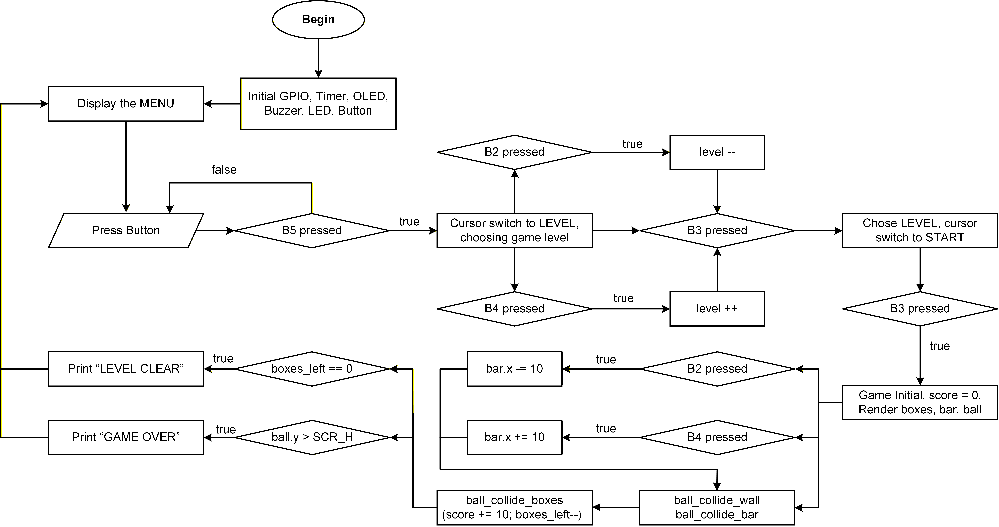

# arknoid - STM32 NUCLEO-F401RE Develop Kit

**arknoid** là game chạy trên STM32 Nucleo-F401RE hiển thị trên màn OLED SPI (Ucglib). Điều khiển bằng nút nhấn (SW1–SW5), có buzzer báo khi nhấn nút điều khiển. Nháy đèn LED khi kết thúc game.

> Vòng đời chương trình: `MENU -> GAME -> GAME OVER/LEVEL CLEAR -> MENU`

## Tính năng của game

- 3 level: Dễ (1) - Trung bình (2) - Khó (3).
- Ấn `B2` để di chuyển thanh sang trái, `B4` để di chuyển thanh sang phải.
- LED nháy 6 lần khi Game Over, 3 lần khi Level Clear.
- Buzzer sẽ kêu khi ấn nút bấm.

## Cách chơi

- Ấn `B5` để con trỏ hình tam giác đi xuống mục chọn level.
- Ấn `B3` để vào mục chọn level. Ở đây có thể thay đổi level bằng nút `B2` (giảm level) hoặc nút `B4` (tăng level). 
- Ấn thêm một lần `B3` để chọn level, khi này con trỏ sẽ xuống mục "START".
- Ấn `B3` một lần nữa và trải nghiệm trò chơi!

## Thuật toán

- Thuật toán di chuyển của bóng: Cập nhật vị trí tiếp theo của bóng thông qua vận tốc: `x += vx; y += vy`.
- Thuật toán va chạm: Cập nhật hướng của vận tốc khi va chạm với tường, với hộp, với thanh chắn.
- Cập nhật điểm, vẽ lại các vật thể khi thay đổi vị trí, cập nhật số lượng hộp còn lại sau khi va chạm với bóng, nhận biết khi nào game kết thúc.
- FSM cho toàn chương trình (`MENU -> GAME -> GAME OVER/LEVEL CLEAR -> MENU`).

<center>


*Hình 1. Lưu đồ thuật toán của chương trình*
</center>

## Cấu trúc dự án

```
.
├── Inc/
│   ├── drivers/
│   │   ├── gpio.h
|   │   └── timebase.h
│   ├── game/ 
│   │   ├── collision.h
│   │   ├── entities.h
│   │   ├── levels.h
│   │   ├── menu_ui.h
│   │   └── run_game.h
│   ├── graphic/ 
│   │   ├── display_init.h
│   │   └── render.h
│   ├── periph/ 
│   │   ├── button.h
│   │   ├── buzzer.h
│   │   └── led.h
│   └── boardconfig.c  
│
├── Src/
│   ├── drivers/
│   │   ├── gpio.c
|   │   └── timebase.c
│   ├── game/ 
│   │   ├── collision.c
│   │   ├── entities.c
│   │   ├── levels.c
│   │   ├── menu_ui.c
│   │   └── run_game.c
│   ├── graphic/ 
│   │   ├── display_init.c
│   │   └── render.c
│   ├── periph/ 
│   │   ├── button.c
│   │   ├── buzzer.c
│   │   └── led.c
│   └── main.c               
│
├── Startup/                  
├── Debug/                    
├── .project / .cproject      
├── arknoid Debug.launch  
├── STM32F401RETX_FLASH.ld    
├── STM32F401RETX_RAM.ld      
└── README.md
```